# 用 Nsight Compute 证明 32×33 Padding 为什么能加速矩阵转置

> 本文记录 RTX 2080 Ti 上 `4096×4096` float transpose 的 profiler 驱动实验。目标不是记住全部 NCU 指标，而是学习如何从异常指标定位代码、提出假设，并用 before/after 证据验证。

## 问题与目标

普通 benchmark 显示，在相同输入和计时范围下：

| variant | kernel 时间中位数 | 有效带宽 |
|---|---:|---:|
| tiled | 0.383280 ms | 350.18 GB/s |
| padded | 0.293168 ms | 457.82 GB/s |

padded 相对 tiled：

```text
speedup = 0.383280 / 0.293168 ≈ 1.307×
```

两者的算法工作量相同，主要代码差异只是：

```cpp
// before
__shared__ float tile[32][32];

// after
__shared__ float tile[32][33];
```

需要回答的不是“padded 更快吗”，而是：

> 为什么只增加一列 shared memory，就能让相同 transpose 快约 30.7%？

## 先看少量核心指标

### Before

```text
Duration                 373.95 μs
Compute Throughput        12.14%
DRAM Throughput           55.42%
L1/TEX Throughput         96.36%
Achieved Occupancy        92.71%
Warp Cycles/Issued Inst  124.14
MIO Throttle              48.2 cycles（约38.8%）
```

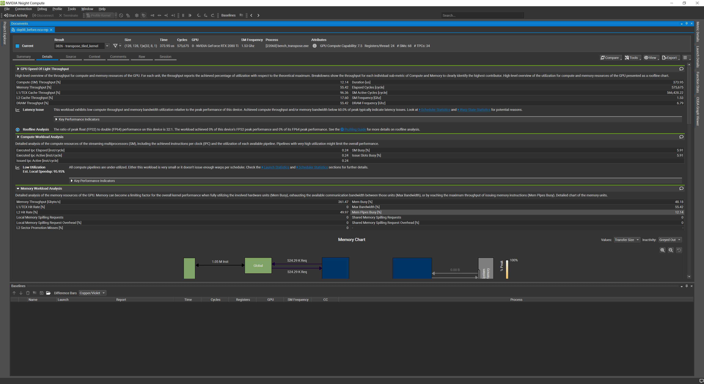

这些数据排除了两个常见误判：

- occupancy 已很高，不能把问题归结为“活跃 warp 太少”；
- Compute Throughput 很低，transpose 也没有大量浮点运算，算力不是瓶颈。

真正异常的组合是：

```text
DRAM尚未饱和，但L1/TEX接近满载；
同时MIO Throttle是最大stall。
```

这表明片上内存相关管线存在拥堵，需要检查 shared-memory 访问。

Warp State 页进一步显示 MIO Throttle 是最大停顿原因：

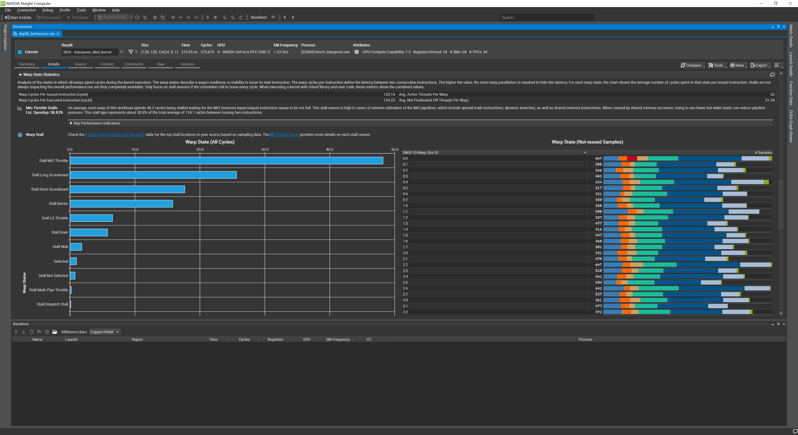

与此同时，before achieved occupancy 已达到 92.71%，不能用“occupancy 太低”解释问题：

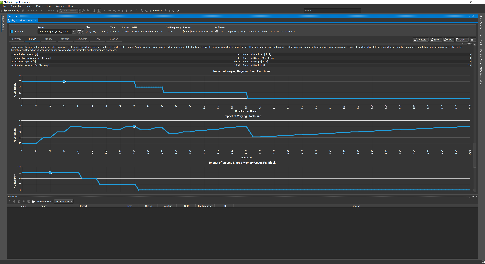

## 代码访问如何映射到 bank

### 无冲突写入

```cpp
tile[threadIdx.y + offset][threadIdx.x] = input[...];
```

一个 warp 中 `threadIdx.x=0..31`，访问同一行的连续 32 个 float，分别落到 32 个 bank，因此 shared-store conflict 为 0。

### 32-way 冲突读取

```cpp
output[...] = tile[threadIdx.x][threadIdx.y + offset];
```

一个 warp 固定第二维、跨 32 行读取。每行长度恰好为 32 个 float：

```text
linear_index = row×32 + fixed_column
bank         = linear_index mod 32
             = fixed_column
```

32 个线程读取不同地址，却全部命中同一个 bank。这不是 broadcast，而是 32-way bank conflict。

## Raw counter 与理论值完全吻合

before 报告：

```text
shared-load conflicts  = 16,252,928
shared-store conflicts = 0
```

矩阵共有 `16,777,216` 个元素，一个 warp 处理 32 个元素：

```text
warp级shared-load请求 = 16,777,216 / 32
                      = 524,288
```

32-way conflict 中，1 份是理想请求，另外 31 份是额外冲突：

```text
524,288 × 31 = 16,252,928
```

计数器与代码推导精确相等，因此可以将假设升级为直接证据。

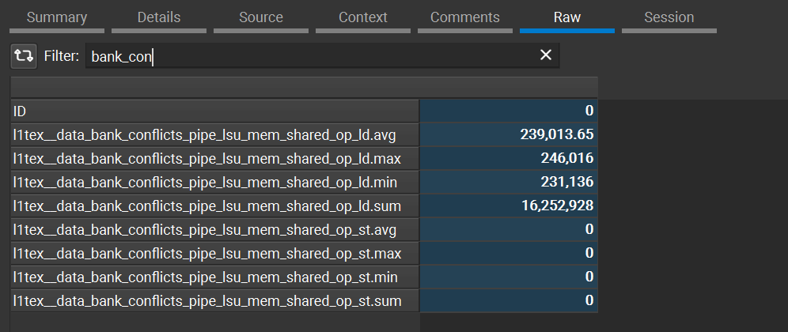

## 修改：把行步长从32改为33

```cpp
__shared__ float tile[32][33];
```

固定列跨行读取时：

```text
bank = (row×33 + fixed_column) mod 32
     = (row + fixed_column) mod 32
```

不同 row 映射到不同 bank。after 报告验证：

```text
shared-load conflicts  = 0
shared-store conflicts = 0
shared-load wavefronts = 524,288
```

每个 warp 请求只需要一个 wavefront，不再拆成 32 份。

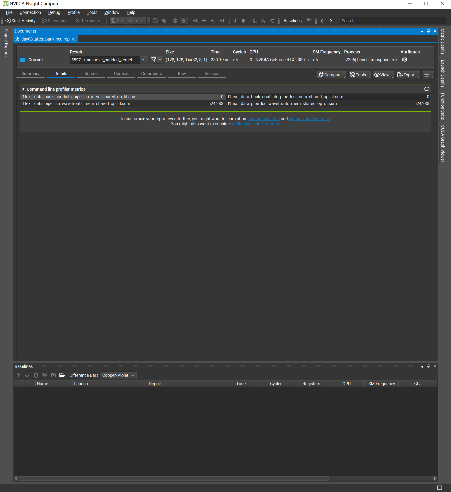

## 修改后的指标变化

| 指标 | before | after | 如何解释 |
|---|---:|---:|---|
| Duration | 373.95 μs | 280.16 μs | 相同采集配置下下降25.08% |
| L1/TEX Throughput | 96.36% | 16.89% | 冲突产生的无效片上事务消失 |
| DRAM Throughput | 55.42% | 72.48% | warp 更持续地推进全局内存访问 |
| Memory Throughput | 361.47 GB/s | 475.38 GB/s | 单位时间完成更多数据搬运 |
| Warp Cycles/Issued Inst | 124.14 | 98.04 | 指令发射间隔缩短21.03% |
| Achieved Occupancy | 92.71% | 97.63% | 始终充足，不是根因 |

L1/TEX 利用率下降在这里是好事，因为工作量相同、时间更短、冲突归零。before 的 96.36% 包含大量被拆分的无效 wavefront，不能简单理解为“利用率越高越好”。

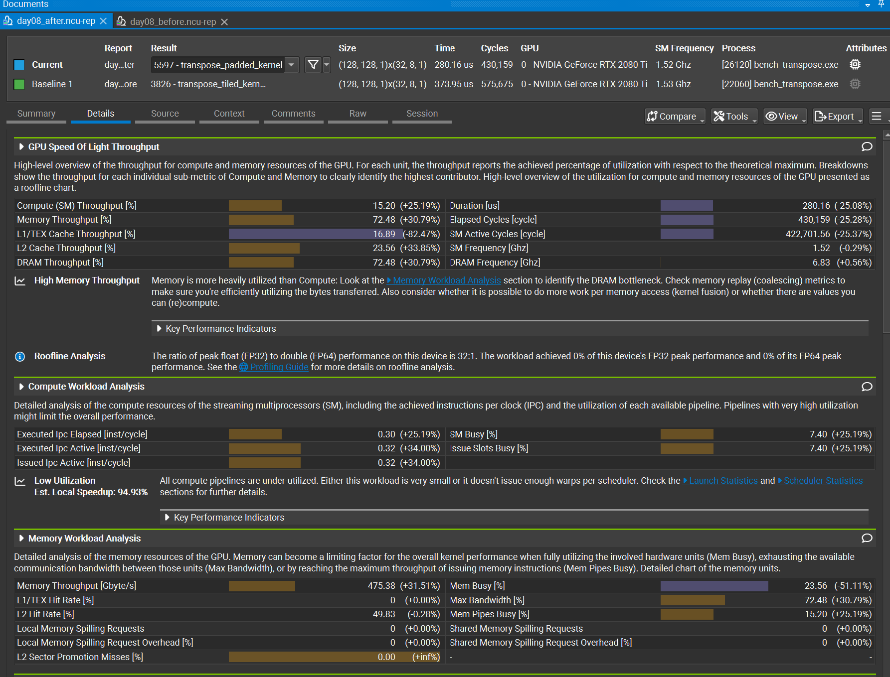

## Stall 如何证明瓶颈转移

before：

```text
MIO Throttle = 48.2 cycles
```

after 图中 MIO Throttle 只剩很小一部分，而：

```text
Long Scoreboard = 80.0 cycles
约占98.0周期发射间隔的81.6%
```

这不表示优化失败。它说明：

```text
shared/MIO拥堵被消除
→ warp更快到达全局内存阶段
→ DRAM吞吐提高
→ 全局内存长延迟成为新的第一限制
```

性能优化往往是移除当前最大瓶颈，然后暴露下一个瓶颈。

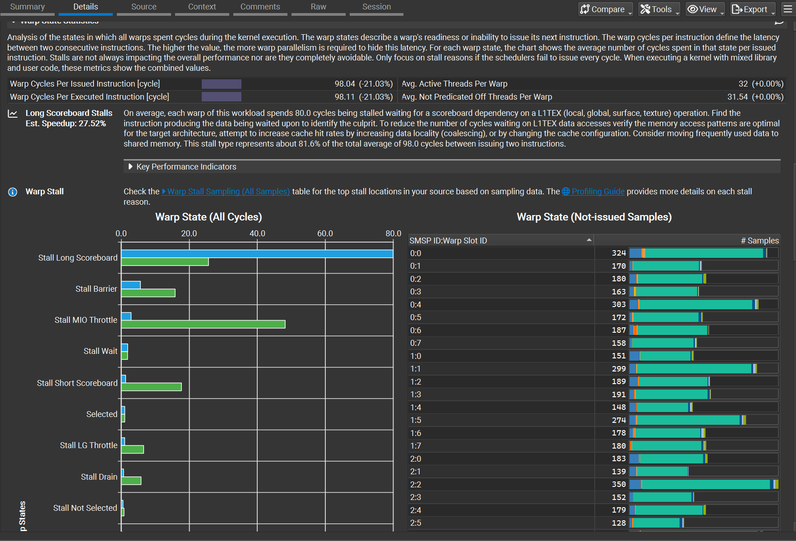

## Occupancy 为什么不是答案

padding 每个 block 只增加：

```text
32×4 = 128字节 shared memory
```

shared-memory 允许的 block 数从 8 降到 7，但真正限制仍是：

```text
Block Limit Warps = 4
```

每 block 有 `256/32=8` 个 warp，SM 上限为 32 个活跃 warp，因此最多 4 个 block。理论 occupancy before/after 都是 100%。

这说明 achieved occupancy 必须结合实际限制资源理解，不能看到非100%就盲目追求更高 occupancy。

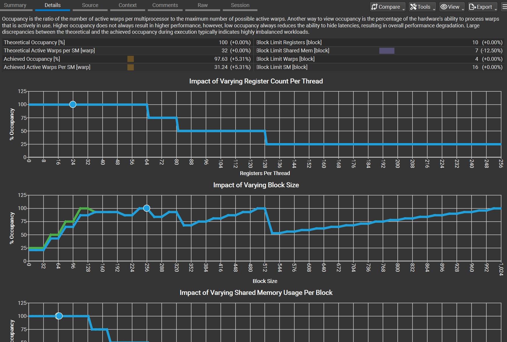

after 还报告了 DRAM slice workload imbalance，估计潜在空间约 6.12%。它是新瓶颈下的次要线索，不影响本次 padding 因果结论，也不应仅凭提示立刻继续改代码。

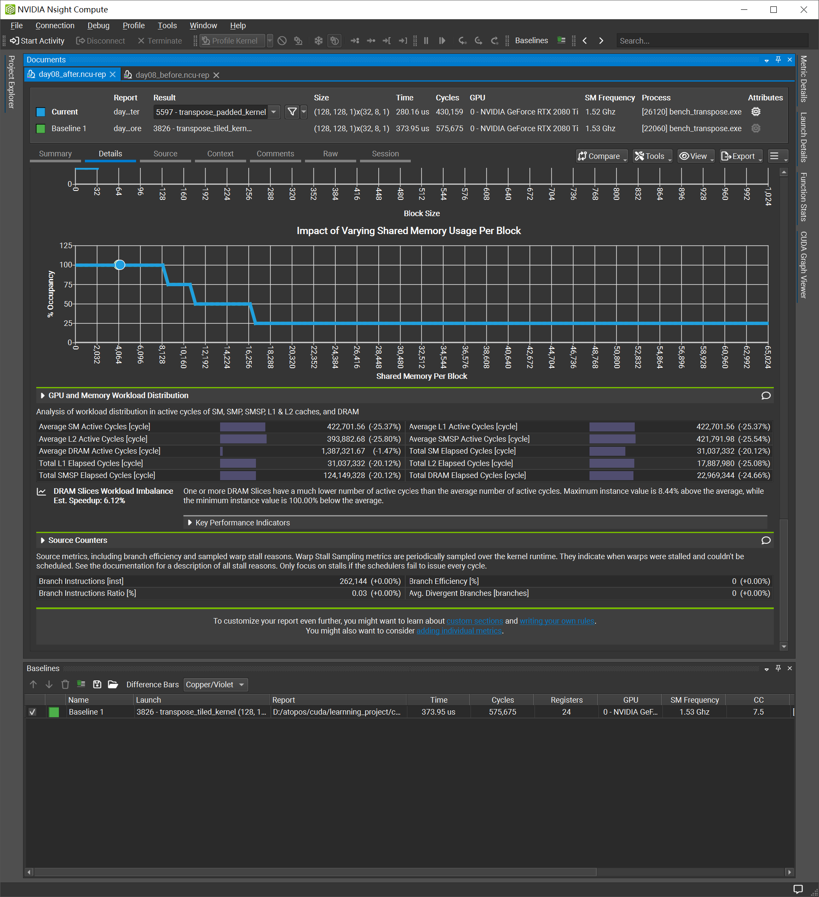

## Source correlation 的作用

Source 页将 CUDA 源码映射到 SASS：

- `LDG`：全局内存读取；
- `STS`：shared memory 写入；
- `LDS`：shared memory 读取；
- `STG`：全局内存写入。

它帮助定位“哪个源码区域产生了相关内存指令”。但源码行的 Attributed Stalls 是统计归因，不应单独替代 bank-conflict Raw counter。正确做法是把 Source、Raw、Warp State 和 benchmark 联合起来。

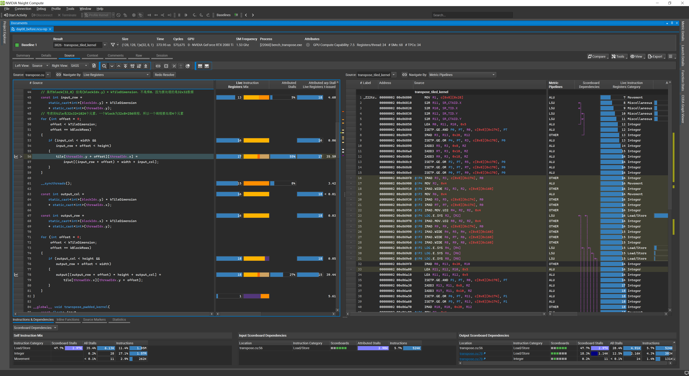

## 为什么第一次搜索没有看到 conflict

在 `detailed` 报告的 Raw 页直接搜索 `bank`，最初只找到：

```text
l1tex__data_bank_reads...pct_of_peak...
l1tex__data_bank_writes...pct_of_peak...
```

这些值表示 bank 读写吞吐相对峰值的比例，不能解释成 conflict rate。

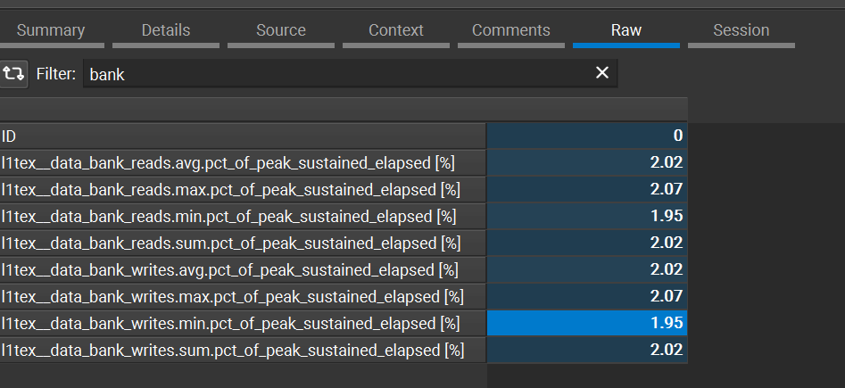

因此后来使用 `--metrics` 单独补采 `bank_conflicts` 和 `wavefronts`。这一步说明：指标名称里含有 `bank`，不代表它测量的就是 bank conflict；必须先读完整指标语义。

## 什么能证明，什么不能证明

### 已验证

- `tile[32][32]` 的转置读取在本 workload 上产生完整 32-way conflict。
- `[32][33]` padding 将 load/store conflict 降为 0。
- 普通 benchmark 中 padded 相对 tiled 加速约 `1.307×`。
- MIO/L1TEX 原瓶颈被移除，限制转移到全局内存路径。

### 不能直接推广

- NCU 的单次 Duration 不是独立 benchmark，不应用作唯一性能结论。
- 结果不能无条件推广到其他 GPU、tile 尺寸或数据类型。
- Long Scoreboard 高不自动表示全局访问未合并；还需 sectors/request 等证据才能判断合并效率。
- 本实验没有覆盖 copy、reduction 的固定 profiling 对照。

## 最小记忆

初学阶段只需记住：

```text
先看时间和吞吐
再看最大的stall
用具体counter验证假设
最后回到普通benchmark确认是否真的更快
```
