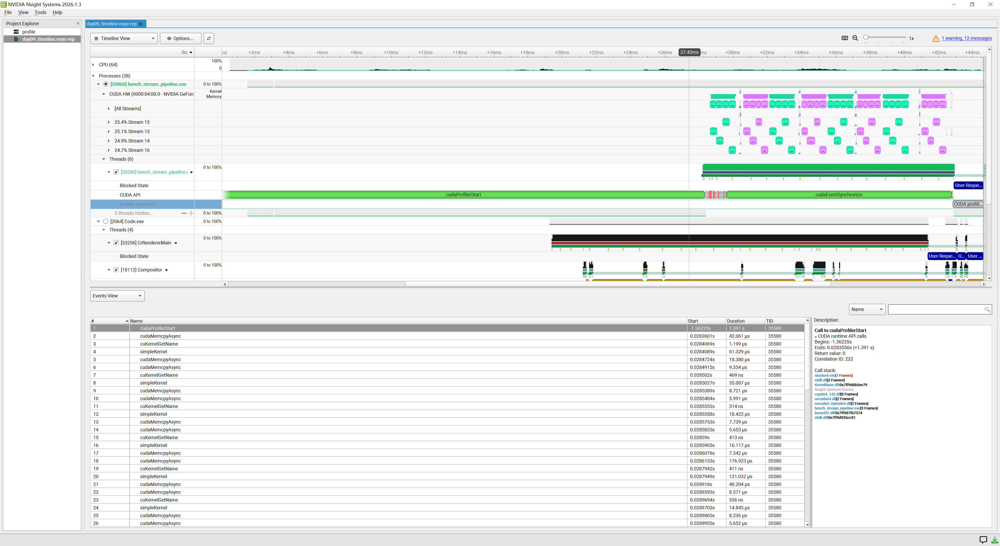
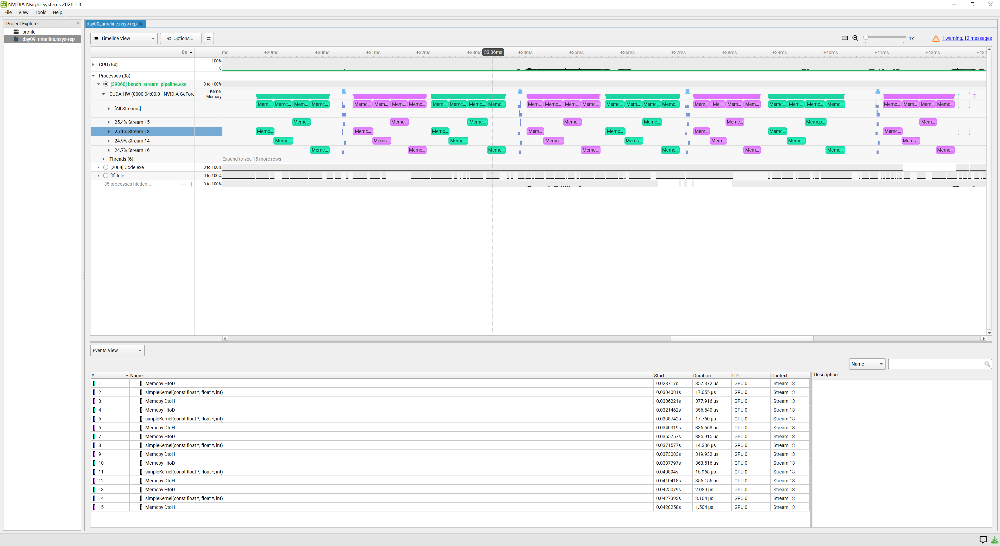
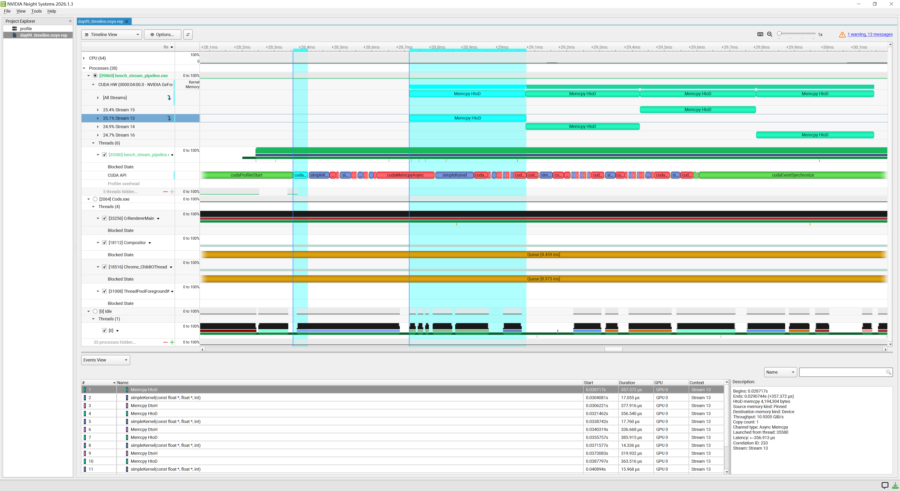
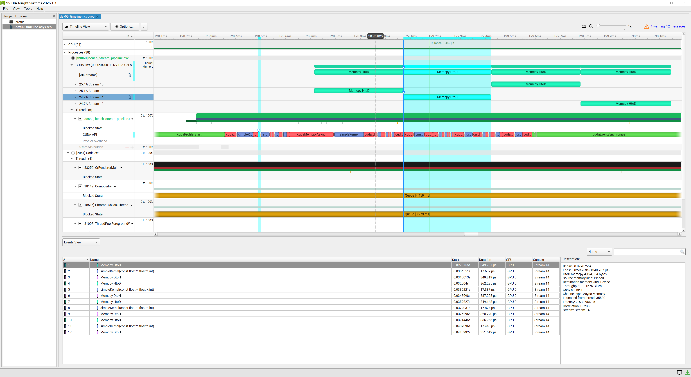
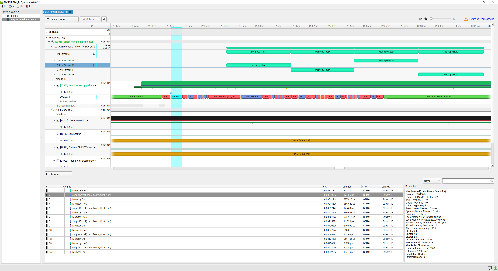

# Day 9 Nsight Systems：4-stream 流水线时间线分析

## 1. 分析目标

Release benchmark 表明，多 stream 能降低本实验的端到端中位时间，但时间变短不能直接证明发生了 copy/compute overlap。本次使用 Nsight Systems 回答三个问题：

1. 17 个 chunk 是否真的分布到了 4 条 stream；
2. H2D、`simpleKernel`、D2H 是否在 GPU 时间线上发生区间重叠；
3. 时间主要消耗在数据传输还是计算。

## 2. 固定配置与采集边界

| 项目 | 值 |
|---|---:|
| 构建 | Release |
| `N` | 16,777,219 |
| block size | 256 |
| stream 数 | 4 |
| chunk size | 1,048,576 个 `float` |
| chunk 数 | 17 |
| 完整 chunk 字节数 | 4,194,304 B |

普通 benchmark 路径使用 20 轮预热和 50 轮正式测量。`--profile` 是另一条专用路径：先在 capture range 外预热 1 轮，再只采集 1 轮固定配置。因此报告中的 17 次 H2D、17 次 kernel 和 17 次 D2H 不是 Nsight 从 50 轮中抽样，而是程序主动限定的单轮采集。

## 3. 手动生成报告

本阶段刻意保留手动命令，不提供一键脚本，以便熟悉 Nsight Systems 的采集参数：

```powershell
nsys profile `
  --trace cuda `
  --capture-range cudaProfilerApi `
  --capture-range-end stop `
  --force-overwrite true `
  --output .\reports\day09_timeline `
  .\build\windows-ninja\Release\bench_stream_pipeline.exe `
  --profile
```

统计命令：

```powershell
nsys stats --report cuda_gpu_sum .\reports\day09_timeline.nsys-rep
nsys stats --report cuda_api_sum .\reports\day09_timeline.nsys-rep
```

归档产物：

- [原始 `.nsys-rep`](../../reports/day09_timeline.nsys-rep)
- [GPU activity 明细 CSV](results/day09_cuda_gpu_trace.csv)

## 4. 从全局时间线开始



先确认三件事：

- CUDA HW 下出现 Stream 13、14、15、16，说明 4 条 stream 被实际使用；
- 每条 stream 内都保持 `H2D -> simpleKernel -> D2H` 的程序顺序；
- 多条 stream 并不自动等于多类硬件活动重叠，仍需放大后逐段比较起止时间。

将 CUDA HW 行展开后，可以看到活动呈批次排列：



```text
一批 H2D -> 一批短 kernel -> 一批 D2H -> 下一批 H2D -> ...
```

绿色 H2D 与紫色 D2H 在不同时间段执行；短 kernel 位于两批 copy 之间。整体没有可见的 copy-compute overlap。

## 5. 逐项读取活动详情

### 5.1 Stream 13 的第一段 H2D



```text
Begins:   0.0287171 s
Duration: 357.372 us
Bytes:    4,194,304
Source:   Pinned
Target:   Device
Stream:   13
```

这证明异步 H2D 的 Host 源确实是 pinned memory。活动结束约为 `0.029074472 s`。

### 5.2 Stream 14 的第一段 H2D



```text
Begins:   0.0290755 s
Duration: 349.787 us
Stream:   14
```

它在 Stream 13 H2D 结束后约 1 μs 才开始。因此即使属于不同 stream，这两次 H2D 也没有重叠，表现为同一方向 copy 被依次执行。

### 5.3 Stream 13 的第一段 kernel



```text
Begins:   0.030408092 s
Duration: 17.055 us
grid:     <<<4096, 1, 1>>>
block:    <<<256, 1, 1>>>
Registers per thread: 16
Theoretical occupancy: 100%
Stream:   13
```

最后一个首批 H2D（Stream 16）结束于约 `0.030147007 s`，第一段 kernel 到 `0.030408092 s` 才开始，中间约有 261 μs 间隔，因此首批 H2D 与 kernel 没有相交。

Stream 16 的第一段 kernel 开始于 `0.030422332 s`，与 Stream 13 kernel 发生约 2.8 μs 的重叠。对完整 CSV 进行区间比较后，共得到 12 对不同 stream 的 kernel overlap，最大约 3.040 μs。这里能证明少量 concurrent kernel，但不能证明 copy-compute overlap。

### 5.4 第一段 D2H

用户在 GUI 中读取到 Stream 13 的第一段 D2H：

```text
Begins:     0.0306221 s
Duration:   377.916 us
Bytes:      4,194,304
Source:     Device
Target:     Pinned
Throughput: 10.3363 GiB/s
Stream:     13
```

首批最后一个 kernel 结束后，第一段 D2H 才开始，两者没有相交。`Latency: 2.150 ms` 表示从 CPU 提交该操作到 GPU 真正开始执行之间的等待，不是 D2H 本身的执行时长；真正的 GPU copy duration 是 377.916 μs。

## 6. `cuda_gpu_sum`：时间花在哪里

| GPU 活动 | Time | 总时间 | 次数 | 平均 | 中位数 | 最小 | 最大 |
|---|---:|---:|---:|---:|---:|---:|---:|
| H2D | 50.0% | 5.827001 ms | 17 | 342.765 μs | 356.956 μs | 2.080 μs | 413.275 μs |
| D2H | 47.6% | 5.550110 ms | 17 | 326.477 μs | 339.163 μs | 1.504 μs | 387.228 μs |
| `simpleKernel` | 2.4% | 0.280763 ms | 17 | 16.516 μs | 17.695 μs | 3.104 μs | 17.887 μs |

H2D 与 D2H 合计占 GPU 活动时间的 97.6%，累计约 11.377 ms；kernel 仅约 0.281 ms。数据传输累计时间约为计算累计时间的 40.5 倍，因此“时间主要花在传输”有直接统计证据。

每类活动最短实例都明显小于完整 chunk，这是最后一个仅含 3 个元素的尾块，不是异常测量。

## 7. 区间重叠统计

使用最终归档 CSV 中每项活动的半开区间 `[start, start + duration)` 比较：

| 重叠类型 | 相交次数 | 最大相交时间 |
|---|---:|---:|
| H2D 与 kernel | 0 | 0 ns |
| kernel 与 D2H | 0 | 0 ns |
| H2D 与 D2H | 0 | 0 ns |
| 不同 stream 的 kernel 与 kernel | 12 对 | 3,040 ns |

因此准确结论是：

> 本配置没有 copy-compute overlap；存在少量、很短的 concurrent kernel overlap。

## 8. `cuda_api_sum`：不要把 API 时间当成 GPU 时间

| CUDA API | 调用次数 | CPU API 总时间 | 含义 |
|---|---:|---:|---|
| `cudaProfilerStart` | 1 | 1,390.610 ms | profiler 初始化开销，不属于流水线工作量 |
| `cudaEventSynchronize` | 4 | 13.254 ms | Host 等待 4 条 stream 的完成 Event |
| `cudaMemcpyAsync` | 34 | 0.710 ms | CPU 向 Runtime 提交 17 次 H2D 和 17 次 D2H |
| `cudaLaunchKernel` | 17 | 0.455 ms | CPU 提交 17 个 kernel |
| `cudaEventRecord` | 4 | 0.015 ms | 在 4 条 stream 尾部记录完成 Event |

`cudaMemcpyAsync` 的 API duration 只是 CPU 调用并提交任务所花的时间，不能拿来代替 GPU 上 Memcpy activity 的 duration。

4 次 `cudaEventSynchronize` 与代码的统一完成边界一致：每条活动 stream 在最后一个 D2H 后记录一个 Event，Host 最后等待 4 个 Event。报告中没有 `cudaDeviceSynchronize` 或 `cudaStreamSynchronize`，说明完成等待没有退化成全设备同步或逐 stream 同步。

## 9. 为什么 pinned memory 仍然没有换来重叠

Pinned memory 解决的是“DMA 能否可靠地直接访问 Host buffer”，提供异步 copy 的必要条件；stream 提供的是潜在并发的任务队列。真正是否重叠，还取决于：

- GPU 的 copy engine / compute engine 能力；
- 操作方向和硬件调度；
- 每个活动的持续时间；
- 提交顺序与队列积压；
- kernel 是否足够长，能覆盖 copy 的一部分。

本实验的 `simpleKernel` 只有约 17 μs，而 4 MiB copy 约 0.34 ms，传输远长于计算。最终调度表现为同类操作成批执行，短 kernel 没有与 copy 形成可观察的交叉区间。

## 10. 最终结论与边界

- 17 个 chunk 正确分布在 4 条 stream，profile 输出通过正确性检查；
- 输入输出均为 pinned memory，异步传输的内存条件满足；
- GPU 时间的 97.6% 花在 H2D/D2H，瓶颈是数据传输；
- 本次没有 H2D-kernel、kernel-D2H 或 H2D-D2H overlap；
- 不同 stream 的 kernel 有少量 overlap，最大约 3.040 μs；
- Release benchmark 加速不能归因于 copy-compute overlap；当前证据不足以精确分解提交开销、批处理和 concurrent kernel 各自的贡献；
- 结论只适用于本机 RTX 2080 Ti、Windows、当前驱动和固定工作负载，不能推广为“多 stream 永远不会重叠”。
